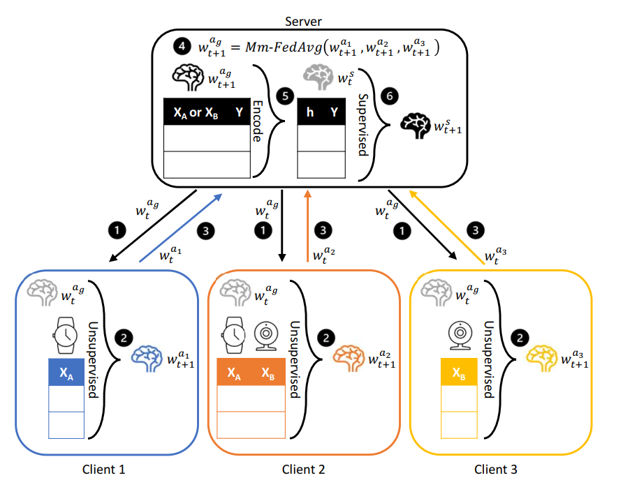

Project 5 Federated Learning on Multimodal Sensor Data
===
This is a course project focused on Federated Learning on Multimodal Sensor Data.
## Group Member: 
### Xiao Wang   
### Zexi Wang

## Motivation:
As machine learning becomes more and more widely used in different areas, concerns rise about protecting user data privacy. Traditional machine learning methods require data to be centralized for training purposes, causing risk of information leakage and malicious use.   
Federated learning, on the other hand, allows the training of machine models without raw data ever leaving its source. This means models are trained locally, which can better preserve data privacy.
The characteristics of FL make it suitable for IoT computing as most of which are deployed separately to collect data. However, many existing FL can online deal with local data from a single modality, which will limit the scalability of the systems. For IoT devices, local data on clients are generated from different modalities. So it’s important to develop a FL framework that works on data from different modalities and clients with different device setups.

## Design goals:
Understand and Re-implement the FL framework which can work on data from multimodality, producing the result with given dataset and analyzing the per-class accuracy. 

## Deliverables:
• Understand multimodal federated learning  
• Use given datasets to reproduce the results in the paper  
• Perform a per-class accuracy analysis of the results and observe the effect of skewed data distribution on the per-class accuracy  
• Evaluate the system on a multimodal dataset that is relatively balanced in class distribution  

## System blocks:

## hw/sw requirements:
• Laptop with CUDA-enabled GPU (optional)  
• Anaconda 3  
• Python 3.7+  
• Pytorch 1.8+  
• Torchvision 0.9+  
• Numpy 1.19+  
• Matplotlib 3.3+
• Scipy 1.4+  
• MPI for Python 3.0+

## Team members responsibilities:
Both group members will participate in depth in this project, both need to thoroughly understand the FL framework and what is expected to achieve.  
Following is Team members’ lead roles (Both will participate but one will be in major role):  
Xiao Wang: Setting up running environments, Building FL framework on our own devices and Test its compatibility with APPLE ARM CUP, Running given dataset to generate results.  
Zexi Wang: Checking the results generated and Performing a per-class accuracy analysis of the results, Analyzing the effect of skewed data distribution on the per-class accuracy.

## Project timeline:
October:   
Setting up running environments for FL framework, Understanding the proposed multimodal federated learning framework, Building FL framework on our own devices and Test its compatibility with APPLE ARM CUP, Running given dataset to generate results.  
November:   
Checking the result with the reference paper, Performing a per-class accuracy analysis of the results, Analyzing the effect of skewed data distribution on the per-class accuracy, Evaluating the system overall performance on the given multimodal dataset. Writing reports about the research work.  

## References:
Paper:   
https://pure-research.york.ac.uk/ws/portalfiles/portal/79047763/2109.04833v2.pdf  
Paper:  
http://proceedings.mlr.press/v54/mcmahan17a/mcmahan17a.pdf  
Code:  
https://github.com/yuchenzhao/iotdi22-mmfl  
Dataset:  
https://drive.google.com/drive/folders/1rWJYkfMavGs1F-H0jykJ5V0fIiwrQdJV  